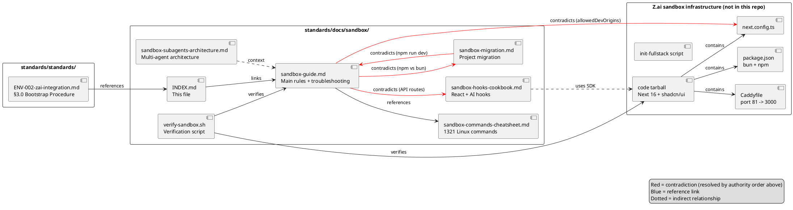

# Z.ai Sandbox Documentation — Index

> Location: `standards/docs/sandbox/`
> Origin: `Z.ai Sandbox Documentation.zip` (uploaded 2026-06-18, original 7-file package)
> Decision: Keep as **reference documentation**, not as skills. See worklog Task ID `extract-pro-skilli-and-sandbox-triage-2026-06-18` for rationale.
> Authoritative source for bootstrap procedure: `standards/standards/ENV-002-zai-integration.md §3.0`

---

## 1. Files in this directory

| File | Origin | Size | Purpose |
|------|--------|------|---------|
| `sandbox-guide.md` | `Z.ai-Sandbox-Guide.md` | 24K | Main guide: 17 sections (Quick Start, Structure, Rules, Dependencies, Preview, Cloning, 6 troubleshooting sections, Submodule, Common Errors, Checklist, Workflow, Golden Rules, Known Issues) |
| `sandbox-hooks-cookbook.md` | `Z.ai-Sandbox-Guide-Hooks.md` | 25K -> INDEX | INDEX file for 4 split sub-files (`hooks-basic.md`, `hooks-ai.md`, `hooks-routes.md`, `hooks-patterns.md`). Custom AI hooks (useChat, useImageGeneration, useAutoSave, useDebounce) + API routes for chat/image/search via `z-ai-web-dev-sdk`. |
| `hooks-basic.md` | (split from cookbook 2026-06-21) | — | Intro + Basic React Hooks (useState/useEffect/useCallback/useMemo/useRef) |
| `hooks-ai.md` | (split from cookbook 2026-06-21) | — | Custom AI Hooks (useAI/useImageGeneration/useChat/useAutoSave/useDebounce) |
| `hooks-routes.md` | (split from cookbook 2026-06-21) | — | API Routes for AI Integration + Middleware Hooks |
| `hooks-patterns.md` | (split from cookbook 2026-06-21) | — | Practical Cases + Best Practices + Project Structure + Quick Ref + Conclusion |
| `sandbox-commands-cheatsheet.md` | `Z.ai-Sandbox-Guide_commands_reference.md` | 47K -> INDEX | INDEX file for 4 split sub-files. 1321 Linux commands across 25 categories. On-demand reference only — do NOT load into context unless needed. |
| `sandbox-commands-file.md` | (split from cheatsheet 2026-06-21) | — | §1-5: File Operations, Viewing/Search, Text Search/Filtering, Text Processing, Archiving |
| `sandbox-commands-system.md` | (split from cheatsheet 2026-06-21) | — | §6-10: Network, System/Processes, Users, Disks, systemd |
| `sandbox-commands-dev.md` | (split from cheatsheet 2026-06-21) | — | §11-16: Python, Node/JS/TS, Java, Perl, C/C++, Git |
| `sandbox-commands-media.md` | (split from cheatsheet 2026-06-21) | — | §17-25: Documents, Graphics/Video, Maps, Data, Web, DB, Editors, Z.ai, Other |
| `sandbox-migration.md` | `Z.ai-Sandbox-Migration Guide.md` | 9.8K | Step-by-step migration of a Next.js/Vercel project between sandbox sessions, with checks for typical errors (rm -rf without verification, token in URL, ERESOLVE, etc.) |
| `sandbox-subagents-architecture.md` | `Z.ai-Sandbox-Super-Z-Subagents-Education.md` | 10K | Architecture of Super Z + subagents: types, parallel execution, statelessness, unified worklog, skills system |
| `verify-sandbox.sh` | `docs/sandbox/verify-sandbox.sh` | 8.5K | Bash script: 11 check groups (bun vs npm, dev server, API routes, allowedDevOrigins, XTransformPort, Dockerfile, versions, z-ai-web-dev-sdk, Prisma, submodule, hooks code quality) |
| `INDEX.md` | `docs/sandbox/INDEX.md` (rewritten) | — | This file — table of contents + cross-document relationships |

---

## 2. When to read which file

| Scenario | Read |
|----------|------|
| Starting a new fullstack project in Z.ai sandbox | `sandbox-guide.md` §1-6 + `ENV-002-zai-integration.md §3.0` |
| Dev server dies on idle / 502 / EADDRINUSE | `sandbox-guide.md` §17.1, §17.2, §8 |
| Adding AI integration (chat/image/search) | `sandbox-hooks-cookbook.md` (INDEX) -> pick `hooks-ai.md` or `hooks-routes.md` |
| React hooks basics | `hooks-basic.md` |
| Migrating project between sandboxes | `sandbox-migration.md` |
| Understanding Super Z subagent architecture | `sandbox-subagents-architecture.md` |
| Verifying project before delivery | `verify-sandbox.sh` (run the script) |
| Forgotten Linux command flag | `sandbox-commands-cheatsheet.md` (INDEX) -> pick `sandbox-commands-{file,system,dev,media}.md` |
| File ops / grep / sed / awk | `sandbox-commands-file.md` |
| Network / process / users / disks | `sandbox-commands-system.md` |
| Python / Node / Java / Perl / C++ / Git | `sandbox-commands-dev.md` |
| PDF / image / SQLite / DB / Z.ai commands | `sandbox-commands-media.md` |

---

## 3. Known contradictions inside the package

The original package documents contain three internal contradictions (flagged in the original `docs/sandbox/INDEX.md`). These are recorded here so that future readers do not re-discover them. None of them block usage — they are resolved by following the order of authority:

> **Authority order:** `ENV-002-zai-integration.md` (current standard) > `sandbox-guide.md` (most recent Z.ai sandbox doc) > other sandbox docs.

| # | Contradiction | sandbox-guide.md says | Other doc says | Resolution |
|---|---------------|------------------------|----------------|------------|
| 1 | Package manager | Use `bun` (not npm) | `sandbox-migration.md` uses `npm install --legacy-peer-deps` and `npm run build` | Use `bun install` and `bun run build`. Migration Guide predates the bun switch. |
| 2 | API routes | "DO NOT create other routes" (§3) | `sandbox-hooks-cookbook.md` creates `app/api/ai/chat/route.ts` | API routes for AI integration via `z-ai-web-dev-sdk` are required and work. The Guide rule targets unnecessary pages, not `/api/*` routes. |
| 3 | `allowedDevOrigins` in `next.config.ts` | Required (else 502) | `init-fullstack` template lacks it | Add `allowedDevOrigins` manually after `init-fullstack`. This is an infra bug in Z.ai, documented. |

---

## 4. Cross-document relationships (PlantUML)



---

## 5. How standards reference this directory

Standards MAY link to files in this directory using relative paths. Example from `ENV-002-zai-integration.md §3.0`:

```markdown
For full Z.ai sandbox rules, see `docs/sandbox/sandbox-guide.md`.
```

Standards MUST NOT inline-copy content from this directory. Always link — this keeps the canonical source in one place and avoids drift.

---

## 6. Maintenance

- **Do not edit** `sandbox-*.md` files in place unless fixing a typo. These are reference copies of upstream Z.ai documentation.
- **Do update** `INDEX.md` when:
  - A new contradiction is discovered (add row to §3)
  - A new file is added to `docs/sandbox/` (add row to §1)
  - The authority order changes (update §3 intro)
- **Do run** `verify-sandbox.sh` before declaring a fullstack project ready (per `ENV-002 §5` Dev Server Protocol).

---

Built with: Next.js 16 + TypeScript + Tailwind CSS
