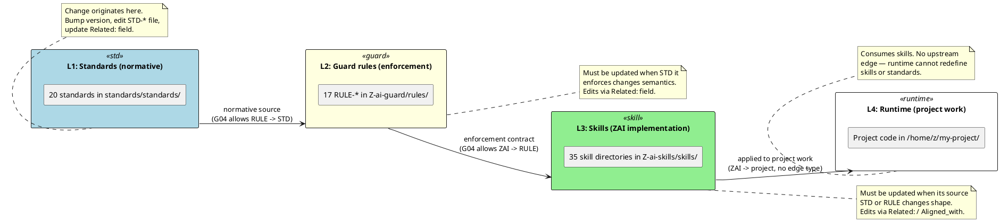

# Standard: Architecture & Repo Layout v1.1.2 (EN)

> ID: STD-ARCH-001
> Version: 1.1.2
> Previous: 1.1.1
> Level: **[C] Critical**
> Last Updated: 2026-06-18
> Effective Date: 2026-06-17
> Status: **APPROVED**
> verified_by: scripts/verify-id-graph.js#G02,G03,G04,G07
> Related: STD-META-001 (ID system)

> **Status: APPROVED.** This revision replaces the v0.1 stub with a full
> normative standard governing the four-repository split of the Z-ai
> ecosystem. All four repositories are now live on GitHub and the
> submodule topology has been exercised end-to-end through both pointer
> bumps and a cross-repo CI workflow. v1.0 formalizes the conventions
> that were already de-facto in `Z-ai-platform/README.md` and
> `Z-ai-platform/CONTRIBUTING.md`.
>
> **Key invariants.** (1) The orchestrator repository MUST pin exactly
> three submodules: `standards/`, `guard/`, `skills/`. (2) Submodule
> URLs MUST be clean HTTPS (no embedded PATs). (3) Layer assignment is
> exclusive — an artifact lives in exactly one repository based on its
> ID prefix. (4) Cross-repo references MUST use ID form (per STD-META-001
> §7.6), never file paths alone. (5) Pointer bumps in the orchestrator
> MUST be atomic per submodule — never combine two submodule bumps in
> one commit.

---

## 1. Purpose

This standard defines the canonical architecture of the Z-ai ecosystem
as a four-repository split with one orchestrator and three submodules.
It exists to answer five recurring questions that, before v1.0, were
resolved ad-hoc and inconsistently across `README.md`, `CONTRIBUTING.md`,
and individual rule files:

1. **Where does a new artifact live?** A new standard, a new rule, a new
   skill — each has exactly one canonical repository based on its ID
   prefix. This standard codifies the mapping.
2. **How do repositories reference each other?** Cross-repo references
   in prose, code comments, AI prompts, and HTML-comment markers MUST
   use ID form. File paths are unstable; IDs are permanent.
3. **What invariants must the submodule topology preserve?** Clean
   URLs, atomic pointer bumps, recursive-clone support, no inlined
   copies of submodule files in the orchestrator.
4. **What is the layer model and what does it constrain?** L0/L1/L2/L3
   is not just a labeling scheme — it determines which `Related:`
   edges are legal (per STD-META-001 §6.1) and which CI checks run
   where.
5. **How are submodule pointers updated and recovered?** The pointer
   update protocol and recovery procedure are normative; agents and
   humans MUST follow them.

By answering these questions in one place, this standard eliminates the
divergence between `README.md` (informal), `CONTRIBUTING.md` (procedural),
and the ID graph (mechanical). When this standard conflicts with the
README, this standard wins.

---

## 2. Scope

This standard applies to:

- **All four repositories** in the Z-ai ecosystem: `Z-ai-platform`,
  `Z-ai-standards`, `Z-ai-guard`, `Z-ai-skills`.
- **All artifacts** carrying an ID under STD-META-001 (i.e. all `STD-*`,
  `RULE-*`, `PROC-*`, `TOOL-*`, and `ZAI-*` artifacts).
- **All scripts** under `*/scripts/` in any of the four repositories
  that read or write across repository boundaries.
- **All CI workflows** under `Z-ai-platform/.github/workflows/`.

This standard does NOT apply to:

- Consumer projects that consume Z-ai-skills as a plain git dependency
  (not as a submodule of Z-ai-platform). Such projects follow
  STD-SKILL-001, not this standard.
- Personal scratch repositories that have not been onboarded as a
  submodule. They are out of scope until promoted.
- The internal layout of the Z.ai sandbox runtime at
  `/home/z/my-project/skills/` — that is governed by STD-SKILL-001 §6.

When in doubt, this standard applies if and only if the artifact in
question carries an ID declared under STD-META-001.

---

## 3. Definitions

| Term                     | Definition                                                                                                                                                                      |
| ------------------------ | ------------------------------------------------------------------------------------------------------------------------------------------------------------------------------- |
| **Orchestrator**         | The `Z-ai-platform` repository. Layer L0. Pins the three submodules and runs cross-repo CI.                                                                                     |
| **Submodule**            | A git submodule pinned by the orchestrator. Three exist: `standards/`, `guard/`, `skills/`.                                                                                     |
| **Layer**                | One of L0 (orchestrator), L1 (standards), L2 (rules/procedures/tools), L3 (skills). Determines which `Related:` edges are legal.                                                |
| **Pointer**              | The commit SHA recorded by git in the orchestrator's index for a given submodule. Bumping a pointer = recording a new SHA.                                                      |
| **Pointer bump**         | A commit in the orchestrator that changes exactly one submodule's recorded SHA. MUST be atomic per submodule.                                                                   |
| **Atomic per submodule** | A single orchestrator commit touches at most one submodule's pointer. The orchestrator's own files (README, CI, hooks) MAY be touched in the same commit.                       |
| **Clean URL**            | A submodule URL in `.gitmodules` that uses the `https://github.com/<owner>/<repo>.git` form with no embedded credentials.                                                       |
| **Recursive clone**      | `git clone --recurse-submodules <url>` — must produce a working tree with all three submodules checked out at the pinned SHAs.                                                  |
| **ID form reference**    | A cross-repo reference written as `<PREFIX>-<DOMAIN>-<NUMBER>` (e.g. `RULE-ARCH-016`), never as a bare file path or title.                                                      |
| **Cross-repo path**      | A filesystem path that starts in one repository and references a file in another. MUST NOT appear in `Related:`/`Aligned_with:` headers; MAY appear in prose with an ID anchor. |

---

## 4. Repository Topology

### 4.1. The Four Repositories

The Z-ai ecosystem consists of exactly four repositories. Adding or
removing a repository requires a major-version bump of this standard
(v1.x -> v2.0) and a migration entry in `Z-ai-platform/MIGRATIONS.md`.

| Repository       | URL                                               | Layer | Purpose                                                                      |
| ---------------- | ------------------------------------------------- | ----- | ---------------------------------------------------------------------------- |
| `Z-ai-platform`  | `https://github.com/stsgs1980/Z-ai-platform.git`  | L0    | Orchestrator: pins submodules, runs cross-repo CI                            |
| `Z-ai-standards` | `https://github.com/stsgs1980/Z-ai-standards.git` | L1    | Standards (`STD-*`), verifiers (`verify-standards.js`, `verify-id-graph.js`) |
| `Z-ai-guard`     | `https://github.com/stsgs1980/Z-ai-guard.git`     | L2    | Rules (`RULE-*`), procedures (`PROC-*`), tools (`TOOL-*`)                    |
| `Z-ai-skills`    | `https://github.com/stsgs1980/Z-ai-skills.git`    | L3    | Skills (`ZAI-*`), skill catalog, skill runtime integration                   |

The orchestrator pins the three submodules via `.gitmodules`:

```ini
[submodule "standards"]
    path = standards
    url = https://github.com/stsgs1980/Z-ai-standards.git
[submodule "guard"]
    path = guard
    url = https://github.com/stsgs1980/Z-ai-guard.git
[submodule "skills"]
    path = skills
    url = https://github.com/stsgs1980/Z-ai-skills.git
```

The submodule names (`standards`, `guard`, `skills`) MUST match the
`path` field. The `path` field MUST be a top-level directory in the
orchestrator (no nested paths like `submodules/standards/`). This
convention is enforced by `verify-id-graph.js` reading the orchestrator
layout.

### 4.2. Why a 4-Repo Split (Not a Monorepo)

The 4-repo split exists so each layer can evolve independently:

1. **Standards can be amended without forcing rule/skill updates.** A
   new version of STD-META-001 lands in `Z-ai-standards`; consumer
   repositories pick it up via `git submodule update` on their own
   schedule. A monorepo would force every rule and skill to be
   re-validated on every standards change.
2. **Guard can ship rule changes on its own cadence.** A new RULE-NNN
   can land in `Z-ai-guard` and be deployed to consumer projects via a
   pointer bump, without dragging in unrelated standards or skills
   changes.
3. **Skills can be consumed standalone by the sandbox runtime.** The
   Z.ai sandbox at `/home/z/my-project/skills/` clones `Z-ai-skills`
   directly — it does NOT need `Z-ai-standards` or `Z-ai-guard`. The
   4-repo split makes this possible.
4. **Cross-repo CI catches drift.** `verify-id-graph.js` runs in
   `Z-ai-platform` CI and verifies that all `Related:` edges across all
   four repos resolve. A monorepo would not catch the same class of
   drift between consumer projects and the canonical sources.

### 4.3. Why Submodules (Not Plain Dependencies)

A plain dependency (e.g. `npm install Z-ai-standards`) would lose three
properties that submodules preserve:

1. **Filesystem presence.** The submodule contents are present on disk
   at a known path. Scripts like `verify-id-graph.js` can be invoked
   directly: `node standards/scripts/verify-id-graph.js`. A dependency
   would require a runtime resolution step.
2. **Version pinning at commit granularity.** A submodule pins a
   specific commit SHA. A dependency pins a semver range, which can
   drift under `^` and `~`.
3. **Purity validation.** `validate.sh` in `Z-ai-guard` can verify that
   a submodule contains ONLY the expected files. A dependency tree
   mixes consumer and provider files, making purity checks impossible.

The trade-off is that submodules require an explicit pointer-update
protocol (§8). This is acceptable: pointer updates are infrequent and
the protocol is mechanical.

---

## 5. Layer Assignment

### 5.1. The Layer Model

Each artifact in the Z-ai ecosystem belongs to exactly one layer.
Layer membership is determined by the artifact's ID prefix per
STD-META-001 §2.1:

| ID prefix | Layer | Owning repository | Repository path                                                                                                         |
| --------- | ----- | ----------------- | ----------------------------------------------------------------------------------------------------------------------- |
| (none)    | L0    | `Z-ai-platform`   | top-level files (`.gitmodules`, `README.md`, `CONTRIBUTING.md`, `install-hooks.sh`, `.github/workflows/*`, `scripts/*`) |
| `STD-`    | L1    | `Z-ai-standards`  | `standards/standards/*.md`                                                                                              |
| `RULE-`   | L2    | `Z-ai-guard`      | `guard/rules/*.md`                                                                                                      |
| `PROC-`   | L2    | `Z-ai-guard`      | `guard/procedures/*.md` (currently inline in `rules/` per existing convention)                                          |
| `TOOL-`   | L2    | `Z-ai-guard`      | `guard/tools/*` and `standards/scripts/verify-*.js`                                                                     |
| `ZAI-`    | L3    | `Z-ai-skills`     | `skills/skills/<skill-name>/SKILL.md`                                                                                   |

An artifact MUST NOT be moved between layers without a migration entry
in `MIGRATIONS.md` of the losing repository. Migrations follow the
protocol in STD-META-001 §8.

### 5.2. Layer Exclusivity

An artifact belongs to exactly one layer. There is no "shared" or
"cross-layer" artifact. Specifically:

- A `RULE-` artifact MUST NOT also be a `STD-` artifact. If a rule is
  promoted to a standard, the old `RULE-` ID is marked `[DEPRECATED]`
  with `superseded_by:` pointing to the new `STD-` ID per STD-META-001
  §8.1.
- A `ZAI-` skill MUST NOT also be a `STD-` standard. The migration of
  ZAI-META-001 content to STD-SKILL-001 (per STD-META-001 §8.4) is the
  canonical example: the skill file becomes a thin pointer, the
  standard file becomes the new home.
- A `TOOL-` artifact MUST NOT be defined inside a `ZAI-` skill. Tools
  live in `Z-ai-guard/tools/` or `Z-ai-standards/scripts/`; skills
  invoke tools, they do not declare them.

### 5.3. What Lives at L0

L0 (the orchestrator) contains ONLY:

- `.gitmodules` — pins the three submodules.
- `README.md` — overview of the platform, ID graph state, quick start.
- `CONTRIBUTING.md` — how to make changes without breaking the ID graph.
- `install-hooks.sh` — bootstrap pre-commit hooks.
- `.githooks/pre-commit` — pre-commit hook (invokes `verify-standards.js`).
- `.github/workflows/*.yml` — CI workflows (currently `verify-id-graph.yml`).

L0 contains NO normative artifacts. It does not declare `STD-*`,
`RULE-*`, `PROC-*`, `TOOL-*`, or `ZAI-*` IDs. The orchestrator's role
is purely to pin and verify — it does not itself carry ID-bearing
content.

This exclusivity is enforced by `verify-id-graph.js` G01 (no duplicate
IDs) implicitly: if the orchestrator declared an ID, it would either
duplicate an existing ID (failing G01) or introduce a new ID with no
`Related:` edges (triggering soft warning W03).

---

## 5A. Cascade State and Propagation Direction

This section formalizes the **direction of propagation** between the
four repositories. It is the normative answer to the question: "when a
standard changes, what else must change, and in what order?"

### 5A.1. Cascade diagram



### 5A.2. Direction rules

| Rule | Statement                                                                                                                       | Enforcement                                                                             |
| ---- | ------------------------------------------------------------------------------------------------------------------------------- | --------------------------------------------------------------------------------------- |
| C-1  | Changes propagate **downward** only (L1 -> L2 -> L3 -> L4).                                                                     | Code review; G04 layer matrix blocks upward edges.                                      |
| C-2  | No layer may redefine semantics declared by a layer above it.                                                                   | G04 + W03 (dead-standard warning catches orphan lower-layer artifacts).                 |
| C-3  | When a standard changes semantics, every RULE/ZAI/SKILL declaring `Related:` to it MUST be reviewed in the same release window. | Manual review checklist in PR template (TODO: link to CONTRIBUTING).                    |
| C-4  | When a RULE changes its enforcement contract, every skill declaring `Related:` to that RULE MUST be reviewed.                   | Same as C-3.                                                                            |
| C-5  | Runtime projects MUST NOT carry local copies of standards or rules. They consume the orchestrator's pinned submodule pointers.  | `verify-standards.js` V14 (planned) + manual review.                                    |
| C-6  | A lower layer MAY propose a change to an upper layer, but only via a PR to the upper repo — never via in-place edit at runtime. | Submodule immutability (RULE-ARCH-016) + pointer update protocol (§8 of this standard). |

### 5A.3. Anti-patterns

These patterns are **forbidden** by the cascade model:

1. **Upward propagation.** A skill edit that silently changes the meaning of a standard. Blocked by G04 (STD <- ZAI is not allowed as a `Related:` edge — skills can declare Related: to standards, but standards cannot declare Related: to skills).
2. **Local fork.** A runtime project that vendors a modified copy of a standard. Blocked by C-5 + RULE-ARCH-016.
3. **Silent enforcement.** A guard rule that enforces a standard the standard never declared. Caught by G02 (Related: must resolve) and W03 (orphan standard = no rule references it).
4. **Stale pointer.** A runtime project pinned to an old submodule SHA while a newer standard has shipped. Caught by nightly CI trigger (§10.3) — nightly runs against latest `main` of submodules, surfacing drift.

### 5A.4. Worked example: bumping STD-ENV-002 from v1.2 to v1.3

When ENV-002 §3.0 Bootstrap Procedure was added (2026-06-18), the
cascade produced these downstream reviews:

| Layer | Artifact                                                      | Required review action                                                                              | Result                                                  |
| ----- | ------------------------------------------------------------- | --------------------------------------------------------------------------------------------------- | ------------------------------------------------------- |
| L1    | `ENV-002-zai-integration.md` v1.3                             | Author the new §3.0 + bump version                                                                  | Done (commit `c0d1dbe`)                                 |
| L2    | `Z-ai-guard/rules/RULE-ENV-008.md` (if it enforces bootstrap) | Verify rule still enforces correct section number; update if section moved                          | No rule currently enforces bootstrap — no action needed |
| L3    | Skills declaring `Related: STD-ENV-002`                       | Verify skill instructions still match new §3.0                                                      | No skills currently declare this — no action needed     |
| L4    | Runtime projects using this standard                          | Re-read standard at next session start; new §3.0 is purely additive (no existing semantics changed) | Will be picked up at next pointer bump                  |

This example shows a **purely additive** L1 change — cascade produced
zero downstream edits because no L2/L3 artifact declared a dependency
on the specific section number that moved.

### 5A.5. Cross-references

- §5 of this standard defines layer assignment; §5A defines the
  direction of propagation between those layers.
- §10.2 of this standard defines cross-repo HARD checks (G01-G15);
  §5A.2 above explains how G04 enforces cascade direction.
- `verify-id-graph.js` W03 warning catches L1 standards that no L2/L3
  artifact references (dead-standard signal — cascade is broken at L1).
- `verify-id-graph.js` W13 warning (v1.1.0+) catches broken cross-doc
  references that would prevent cascade propagation from being
  machine-traceable.

---

## 6. Submodule Conventions

### 6.1. `.gitmodules` Hygiene

The `.gitmodules` file in the orchestrator MUST conform to:

1. **Exactly three submodules.** No more, no less. Adding a fourth
   submodule requires a major-version bump of this standard.
2. **Clean HTTPS URLs only.** Every `url =` line MUST match
   `^https://github\.com/<owner>/<repo>\.git$`. Embedded credentials
   (`https://<user>:<token>@github.com/...`) are FORBIDDEN — they
   cause auto-revocation by GitHub's secret scanner and leak PATs into
   the commit history.
3. **Submodule name equals path.** The `[submodule "<name>"]` field
   MUST equal the `path =` field. This avoids the confusing pattern
   where a submodule is registered under one name but checked out at a
   different path.
4. **Top-level paths only.** The `path =` field MUST be a top-level
   directory (`standards`, `guard`, `skills`). Nested paths like
   `vendor/standards/` are FORBIDDEN — they break `verify-id-graph.js`
   path resolution.
5. **No `branch =` field.** Submodules are pinned to a specific commit
   SHA. The `branch =` field is a footgun: it causes
   `git submodule update --remote` to track a branch, which can advance
   the pointer unexpectedly. The orchestrator records explicit SHAs
   only.

### 6.2. Recursive Clone Support

`git clone --recurse-submodules https://github.com/stsgs1980/Z-ai-platform.git`
MUST produce a working tree with all three submodules checked out at
the pinned SHAs. This is verified by the `verify-standards.js` and
`verify-id-graph.js` scripts (run by the `.githooks/pre-commit` hook
and by the `verify-id-graph.yml` CI workflow).

If recursive clone fails (e.g. because a submodule URL was renamed),
the recovery procedure is §9.2 of this standard.

### 6.3. No Inlined Copies

Files that live in a submodule MUST NOT be copied into the orchestrator.
This includes:

- Copying `standards/scripts/verify-id-graph.js` to
  `Z-ai-platform/scripts/verify-id-graph.js`.
- Copying `guard/rules/RULE-ARCH-016.md` to
  `Z-ai-platform/RULE-ARCH-016.md`.
- Copying `skills/skills/skill-creator/SKILL.md` to
  `Z-ai-platform/skill-creator.md`.

Inlined copies drift from the canonical source within days. They are
FORBIDDEN. This rule extends RULE-ARCH-016 (submodule immutability)
to the orchestrator's own layout.

### 6.4. Submodule Internal Layout

Each submodule MUST expose a predictable internal layout so that
`verify-id-graph.js` can find artifacts without per-repo configuration:

| Submodule    | Required paths                                           | Notes                                                                                                                                                                                       |
| ------------ | -------------------------------------------------------- | ------------------------------------------------------------------------------------------------------------------------------------------------------------------------------------------- |
| `standards/` | `standards/*.md`, `scripts/verify-*.js`, `MIGRATIONS.md` | All `STD-*` files live in `standards/standards/`                                                                                                                                            |
| `guard/`     | `rules/*.md`, `INDEX.md`                                 | All `RULE-*` files live in `guard/rules/`                                                                                                                                                   |
| `skills/`    | `skills/<skill-name>/SKILL.md`, `skills/INDEX.md`        | All `ZAI-*` skills live one level under `skills/skills/` (note the doubled `skills/` — this is intentional: `skills/` is the submodule path, `skills/` inside it is the skill catalog root) |

The doubled `skills/skills/` path is a known wrinkle. It exists because
the submodule name is `skills` (matching the path) and the skill
catalog root inside the submodule is also named `skills`. This is
preserved for backward compatibility with existing skill-creator
conventions.

---

## 7. Cross-Repo Path References

### 7.1. ID Form is Mandatory in Headers

In `Related:` and `Aligned_with:` header fields, references MUST use
ID form (`RULE-ARCH-016`), never file paths (`guard/rules/RULE-ARCH-016.md`).
This is enforced by `verify-id-graph.js` G02 (references must resolve)
and G12 (format violations).

### 7.2. ID Form is Preferred in Prose

In prose (markdown body text, code comments, AI prompts), references
SHOULD use ID form. File paths MAY appear alongside IDs for navigation
convenience, but the ID MUST be present:

```markdown
<!-- GOOD -->

This procedure implements **RULE-ENV-008** by enforcing the sandbox
constraints declared in **STD-ENV-001**.

<!-- BAD — file path alone, no ID -->

This procedure implements `guard/rules/RULE-ENV-008.md` by enforcing
the sandbox constraints declared in `standards/ENV-001-reproducibility.md`.
```

### 7.3. Cross-Repo Paths in Scripts

Scripts that need to invoke files across repository boundaries MUST
resolve paths relative to the orchestrator root, not relative to the
script's own location. The orchestrator root is the directory containing
`.gitmodules`.

```javascript
// GOOD — resolve from orchestrator root
const platformRoot = path.resolve(__dirname, "..", "..", "..");
const verifyScript = path.join(platformRoot, "standards", "scripts", "verify-id-graph.js");

// BAD — assumes cwd, breaks when invoked from elsewhere
const verifyScript = "standards/scripts/verify-id-graph.js";
```

The `verify-id-graph.js` script itself follows this convention: it
discovers the four repositories by walking up from its own location
until it finds `.gitmodules`, then resolves `standards/`, `guard/`,
`skills/` relative to that root.

### 7.4. Cross-Repo Paths in CI Workflows

CI workflows in `.github/workflows/*.yml` MUST use paths relative to
the orchestrator root, because GitHub Actions checks out the orchestrator
at the workspace root by default. The workflows MUST invoke
`git submodule update --init --recursive` (or use
`actions/checkout@v4` with `submodules: recursive`) before referencing
any submodule path.

---

## 8. Pointer Update Protocol

### 8.1. When to Bump a Pointer

A submodule pointer is bumped in the orchestrator when:

1. The submodule's `main` branch has advanced with changes that the
   orchestrator needs to consume (e.g. a new rule was added to
   `Z-ai-guard` and the orchestrator's CI should now enforce it).
2. A fix in the submodule needs to be picked up by the orchestrator's
   pre-commit hook (e.g. a bugfix in `verify-id-graph.js`).
3. A migration in the submodule needs to be reflected in the
   orchestrator's ID graph state (e.g. a rule was deprecated).

A pointer bump is NOT required when:

- The submodule's `main` branch advances with changes that do not
  affect the orchestrator (e.g. a typo fix in a skill README).
- The submodule's `main` branch advances with changes that have not
  yet been validated by the submodule's own CI.

### 8.2. The Bump Procedure

A pointer bump MUST follow this procedure. Deviations cause ID graph
inconsistencies that CI will catch, but recovery is annoying.

1. **Pull the submodule's latest main inside the submodule directory.**
   ```bash
   cd standards  # or guard/, or skills/
   git checkout main
   git pull origin main
   cd ..
   ```
2. **Run the verifier locally to confirm the new state is consistent.**
   ```bash
   node standards/scripts/verify-id-graph.js
   ```
   If the verifier fails, DO NOT proceed. The submodule's `main` has
   a broken state. Report it to the submodule's maintainer.
3. **Stage the submodule pointer.**
   ```bash
   git add standards  # or guard/, or skills/
   ```
4. **Commit with a descriptive message.** The message MUST mention the
   submodule name, the new SHA (short form), and the reason.
   ```bash
   git commit -m "Bump standards: 447725b -> abc1234 (add STD-ARCH-001 v1.0)"
   ```
5. **Push the orchestrator.**
   ```bash
   git push origin main
   ```
6. **Verify CI passes.** The push triggers `.github/workflows/verify-id-graph.yml`,
   which re-runs the verifier against the new pointer. If CI fails,
   see §9.1 (recovery).

### 8.3. Atomicity

A single orchestrator commit MUST touch at most one submodule's pointer.
Combining two submodule bumps in one commit is FORBIDDEN because:

- It makes `git bisect` impossible (which submodule caused the failure?).
- It makes the commit message ambiguous.
- It breaks the assumption in `verify-id-graph.js` that a single
  pointer bump corresponds to a single logical change.

The orchestrator's own files (`.gitmodules`, `README.md`, `CONTRIBUTING.md`,
`.github/workflows/*`, `scripts/*`) MAY be touched in the same commit
as a single submodule bump. This is common when a README update
accompanies a pointer bump to reflect new ID graph state.

### 8.4. Pointer Bump in CI

When the orchestrator's CI runs `verify-id-graph.js`, it does so against
the pinned submodule SHAs (after `git submodule update --init --recursive`).
If the submodule's `main` has advanced beyond the pinned SHA but the
pointer has not been bumped, CI runs against the pinned SHA — this is
correct behavior. The pointer bump is a deliberate act by the
orchestrator's maintainer.

---

## 9. Recovery Procedures

### 9.1. CI Fails After a Pointer Bump

If the orchestrator's CI fails after a pointer bump, the cause is one
of:

1. **The submodule's `main` is broken.** The submodule's own CI should
   have caught this, but if it didn't, the orchestrator's CI is the
   second line of defense. Recovery: revert the pointer bump in the
   orchestrator (`git revert <commit>`), report the issue to the
   submodule's maintainer.
2. **The pointer bump was not atomic.** If the commit touched two
   submodules, bisect is required. Recovery: revert the commit, redo
   the bumps as separate commits per §8.3.
3. **The orchestrator's own files changed incompatibly.** For example,
   a workflow file was edited in the same commit and references a
   script path that doesn't exist. Recovery: revert the commit, fix
   the orchestrator files, redo the bump.

In all three cases, the recovery is `git revert` followed by a corrected
commit. DO NOT force-push to the orchestrator's `main` — branch
protection should be enabled (per RULE-ARCH-017 §"Enforcement
layers").

### 9.2. Recursive Clone Fails

If `git clone --recurse-submodules` fails, the cause is one of:

1. **A submodule URL was renamed.** The `.gitmodules` URLs are stale.
   Recovery: update `.gitmodules` with the new URLs, commit, push. The
   next recursive clone will succeed.
2. **A submodule was made private.** The clone lacks credentials.
   Recovery: either make the submodule public again, or document that
   the ecosystem requires authenticated access (and update
   `Z-ai-platform/README.md` accordingly).
3. **A submodule was deleted.** This is a topology change requiring a
   major-version bump of this standard. Recovery: follow the migration
   protocol in STD-META-001 §8.

### 9.3. Submodule Pointer Drift

If `git status` inside the orchestrator shows a modified submodule
(`M standards` or `M guard` or `M skills`), it means the submodule's
checked-out commit does not match the orchestrator's recorded SHA. Two
causes:

1. **The submodule was updated locally but not committed.** Recovery:
   follow §8.2 from step 3 onward.
2. **The submodule was checked out at a different branch.** Recovery:
   `cd <submodule> && git checkout main && cd ..` — this restores the
   submodule to the recorded SHA.

DO NOT commit a submodule pointer drift without running the verifier
locally. A drift commit that breaks the ID graph will fail CI and
require `git revert`.

---

## 10. Validation Matrix

### 10.1. Per-Repository Checks

Each repository runs its own per-repo checks in its own CI:

| Repository       | Check                                     | Tool                               | Strictness |
| ---------------- | ----------------------------------------- | ---------------------------------- | ---------- |
| `Z-ai-standards` | Header format conforms to STD-META-001 §5 | `verify-standards.js` V05/V11      | HARD       |
| `Z-ai-standards` | Registry sync (§4 of each STD file)       | `verify-standards.js` V05 extended | HARD       |
| `Z-ai-standards` | `Related:` references resolve within repo | `verify-standards.js` V12          | HARD       |
| `Z-ai-guard`     | Rule headers conform to format            | `verify-standards.js` V05          | HARD       |
| `Z-ai-guard`     | Rule registry sync                        | `verify-standards.js` V05 extended | HARD       |
| `Z-ai-skills`    | YAML frontmatter parses                   | `verify-standards.js` V13a         | HARD       |
| `Z-ai-skills`    | Required fields present                   | `verify-standards.js` V13b         | HARD       |
| `Z-ai-skills`    | `name` matches folder                     | `verify-standards.js` V11b         | HARD       |

### 10.2. Cross-Repository Checks

The orchestrator runs cross-repo checks in its CI (the
`verify-id-graph.yml` workflow). These checks CANNOT run in any single
submodule's CI because they require all four repositories to be
checked out simultaneously.

| Check                                  | Tool                 | Strictness | What it validates                                            |
| -------------------------------------- | -------------------- | ---------- | ------------------------------------------------------------ |
| G01: No duplicate IDs across repos     | `verify-id-graph.js` | SOFT       | Two artifacts in different repos don't claim the same ID     |
| G02: All `Related:` references resolve | `verify-id-graph.js` | HARD       | Every `Related:` target exists somewhere in the 4-repo graph |
| G03: No cycles in `Related:` graph     | `verify-id-graph.js` | HARD       | The directed graph has no cycles                             |
| G04: Layer matrix respected            | `verify-id-graph.js` | HARD       | `Related:` edges conform to STD-META-001 §6.1                |
| G07: No STD -> (RULE/PROC/TOOL/ZAI)    | `verify-id-graph.js` | HARD       | Standards are self-contained (this standard's §5.2)          |
| G14: Compatibility DAG valid for ZAI   | `verify-id-graph.js` | HARD       | Skill compatibility fields respect STD-META-001 §6.4         |
| G15: Aligned_with has Related edge     | `verify-id-graph.js` | HARD       | Aligned_with declarations are backed by a dependency         |

### 10.3. CI Triggers

The orchestrator's CI workflow triggers on:

1. **Push to `main`** in `Z-ai-platform` (covers pointer bumps and
   orchestrator file changes).
2. **Pull request to `main`** (covers proposed changes before merge).
3. **Nightly at 03:00 UTC** (catches drift if submodule `main`
   advanced without a pointer bump — though the orchestrator's CI
   always runs against pinned SHAs, nightly gives visibility into
   "what would happen if we bumped to latest main").
4. **Manual dispatch** via GitHub Actions UI (for debugging).

The workflow does NOT trigger on pushes to submodule repositories
directly. Submodule repositories have their own per-repo CI. The
orchestrator's CI picks up submodule changes only when a pointer bump
lands in the orchestrator's `main`.

---

## 10A. Known Issues and Proposed Solutions

This section documents discovered inconsistencies, missing content, and proposed corrections. Each issue has an ID, status, and proposed action. Issues resolved in the current version are marked `[RESOLVED]`; outstanding issues are marked `[OPEN]`.

### ARCH-001-001 `[RESOLVED in v1.1]` — No §XA Known Issues section (W12 warning)

**Problem:** v1.0 had no §XA Known Issues section. verify-id-graph.js v1.1.0 W12 warning flagged this as inconsistent with the convention established in ENV-002 v1.2 §10A.

**Resolution:** This section (§10A) added in v1.1. Convention now followed.

### ARCH-001-002 `[OPEN]` — §5A.3 references planned verifier `verify-standards.js V14` that does not exist yet

**Problem:** §5A.3 anti-pattern #2 says "Blocked by C-5 + RULE-ARCH-016". §5A.2 rule C-5 says "verify-standards.js V14 (planned) + manual review". The V14 check is planned but not implemented. As of 2026-06-18, only manual review catches local forks of standards in runtime projects.

**Proposed solution:** Implement `verify-standards.js V14` — scan project tree for files matching `standards/<DOMAIN>-<NNN>-<name>.md` pattern that are NOT part of the orchestrator's submodule pin. Lower priority than W13 sweep (75 broken refs) and W11 CRITICAL (DESIGN-001 split).

### ARCH-001-003 `[OPEN]` — §5A.4 worked example hardcodes commit SHA `c0d1dbe`

**Problem:** §5A.4 references commit `c0d1dbe` as the example. Over time this SHA will become stale as the standards repo advances.

**Proposed solution:** Either (a) replace the SHA with a relative reference ("the commit that introduced §3.0"), or (b) accept the staleness as documentation of when the example was authored. Lean towards (b) — historical context is useful for understanding the example.

### ARCH-001-004 `[OPEN]` — §5A references planned artifacts not yet shipped (RULE-ENV-008, skills/INDEX.md, doctor.sh)

**Problem:** §5A cascade diagram and worked example reference artifacts that do not exist yet:

- `Z-ai-guard/rules/RULE-ENV-008.md` (planned rule for bootstrap enforcement)
- `Z-ai-skills/skills/INDEX.md` (planned skills tree index)
- `Z-ai-platform/doctor.sh` (planned diagnostics script)
- bare `INDEX.md` (disambiguate via context — `docs/sandbox/INDEX.md` exists, `skills/INDEX.md` planned)

These references are intentional — they describe the target state of the cascade model, not the current state. Without them, the cascade section would describe only what exists today, not what the architecture is building toward.

**Resolution (partial):** As of verify-id-graph.js v1.1.2, these planned references are in the W13 whitelist (see `W13_WHITELIST` constant in `scripts/verify-id-graph.js`). They do not generate W13 warnings. When the planned artifacts ship, they should be removed from the whitelist so the verifier catches any future breakage.

**Proposed solution:** Track in issue tracker: (1) create `RULE-ENV-008.md` when bootstrap enforcement rule is needed, (2) create `Z-ai-skills/skills/INDEX.md` when skills tree grows past 50 entries, (3) create `doctor.sh` when CI diagnostics are needed. Each creation triggers whitelist cleanup.

---

## 11. Related Artifacts

- **STD-META-001** — ID system that defines prefixes, layers, and the
  `Related:`/`Aligned_with:` edge semantics. This standard depends on
  STD-META-001 for its vocabulary.
- **STD-DOC-002** — Documentation conventions (header formats, section
  ordering, cross-reference syntax). This standard follows STD-DOC-002
  for its own document structure.
- **RULE-ARCH-016** (in `Z-ai-guard`) — Submodule immutability rule.
  This standard formalizes the architecture that RULE-ARCH-016
  protects. The rule references this standard via its own `Related:`
  field (RULE -> STD is allowed per STD-META-001 §6.1).
- **RULE-ARCH-017** (in `Z-ai-guard`) — Upstream write protection
  rule. This standard defines the submodule topology that
  RULE-ARCH-017 governs write access to.
- **`Z-ai-platform/README.md`** — Informal overview of the platform.
  When in conflict, this standard wins.
- **`Z-ai-platform/CONTRIBUTING.md`** — Procedural guide for
  contributors. Procedural details (e.g. "how to run the verifier
  locally") live in CONTRIBUTING.md; normative requirements live in
  this standard.

---

## 12. Change History

| Version | Date       | Changes                                                                                                                                                                                                                                                                                                                                                                                                                        |
| ------- | ---------- | ------------------------------------------------------------------------------------------------------------------------------------------------------------------------------------------------------------------------------------------------------------------------------------------------------------------------------------------------------------------------------------------------------------------------------ |
| 0.1.0   | 2026-06-17 | Stub. Reserved the ID. Listed intended scope.                                                                                                                                                                                                                                                                                                                                                                                  |
| 1.0.0   | 2026-06-17 | Full normative standard. Adds: repository topology (§4), layer assignment (§5), submodule conventions (§6), cross-repo path references (§7), pointer update protocol (§8), recovery procedures (§9), validation matrix (§10). Promoted from `[B] Recommended` to `[C] Critical`.                                                                                                                                               |
| 1.1.0   | 2026-06-18 | Added §5A Cascade State and Propagation Direction (cascade diagram, 6 direction rules C-1..C-6, 4 anti-patterns, worked example for STD-ENV-002 v1.2 -> v1.3 bump). Added §10A Known Issues (ARCH-001-001 resolved, ARCH-001-002/003 open). Closes W12 warning on this file.                                                                                                                                                   |
| 1.1.1   | 2026-06-18 | Added ARCH-001-004 Known Issue (§5A references to planned artifacts documented, W13 whitelist in verify-id-graph.js v1.1.2 covers them).                                                                                                                                                                                                                                                                                       |
| 1.1.2   | 2026-06-18 | Retired dead scripts. Dropped `verify-cascade.js` from §4.1 L1 verifier list (TOOL-VERIFY-003 RETIRED in META-001 §4.15). Dropped `scripts/*.js` from §5 L0 layout (parent `scripts/` directory removed — was empty after `cross-validator-test.js` deletion). Replaced §6.2 reference to `cross-validator-test.js` with the actual live verifiers (`verify-standards.js` + `verify-id-graph.js` run by pre-commit hook + CI). |
